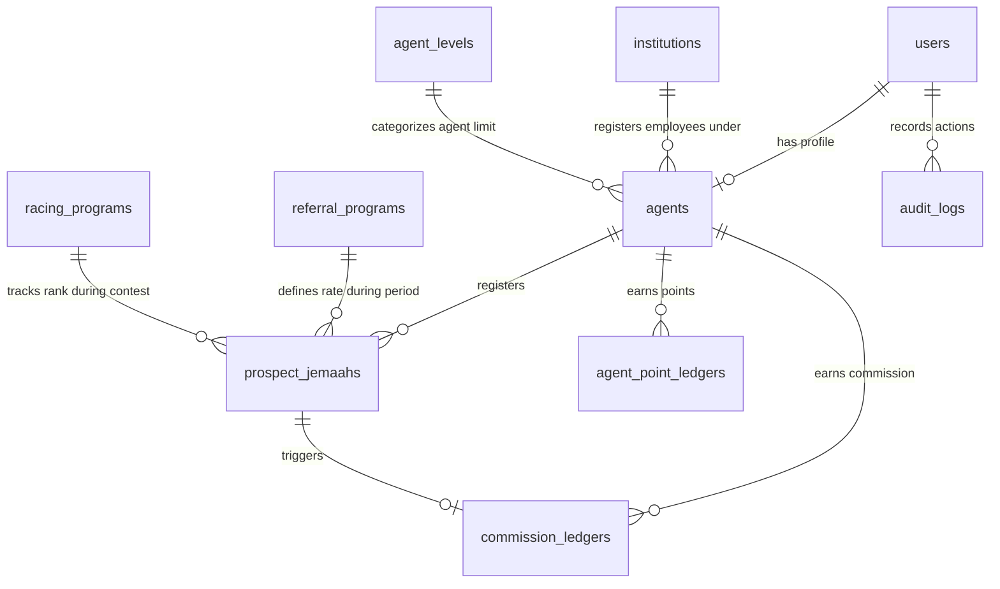

# Dokumentasi Aplikasi Portal Agen Haji BPKH

Dokumen ini menyajikan panduan komprehensif mengenai arsitektur, proses bisnis, penanganan data, dan panduan teknis aplikasi Portal Agen Haji Badan Pengelola Keuangan Haji (BPKH).

---

## 1. Pendahuluan & Proses Bisnis (Business Process)

Aplikasi Portal Agen Haji BPKH dirancang untuk memfasilitasi koordinasi, pencatatan, verifikasi, dan pemberian insentif bagi tenaga pemasar/agen haji secara nasional dalam menjaring calon jemaah haji (reguler maupun khusus).

### A. Alur Pendaftaran & Verifikasi Agen
1. **Registrasi Awal**: Agen dapat mendaftar secara mandiri melalui form registrasi umum atau menggunakan Google Authentication. Terdapat dua jenis agen:
   - **Freelance**: Agen perorangan/mandiri.
   - **Institusi (B2B)**: Agen yang berafiliasi dengan lembaga/mitra institusi resmi BPKH (misal: bank, KBIHU, ormas).
2. **Wizard Dokumen & Profil**: Setelah registrasi akun, agen wajib menyelesaikan wizard pengisian kelengkapan berkas:
   - Pengunggahan berkas KTP, Foto Diri, Foto Bangunan, NPWP, dan Buku Tabungan.
   - Pengisian koordinat lokasi tinggal (Latitude/Longitude).
   - Pengunggahan berkas Pakta Integritas (dokumen wajib syariah).
   - Khusus Agen Institusi B2B: Mengunggah bukti pekerja, Surat Keputusan (SK) pengangkatan, dan Nomor Induk Pegawai (NIP).
3. **Verifikasi Admin**:
   - Berkas pendaftaran masuk ke dalam panel **Verifikasi & Validasi Admin** pada dashboard **Admin Haji / Superadmin**.
   - Admin berhak menyetujui berkas pendaftaran (**Aktivasi Akun**) atau menolak pendaftaran dengan memberikan catatan perbaikan tertulis (**Tolak dengan Catatan**).
   - Jika ditolak, status akun agen ditangguhkan (*suspended*) dan agen akan diarahkan kembali ke wizard perbaikan berkas di dashboard pribadinya berdasarkan catatan admin tersebut.
   - Khusus Agen Institusi B2B: Pendaftaran sub-agen di bawah institusinya dapat diverifikasi dan disetujui secara langsung oleh administrator institusi terkait tanpa menunggu persetujuan pusat BPKH.

### B. Registrasi Calon Jemaah Haji (CRM Jemaah)
- Agen yang telah aktif dapat mendaftarkan prospek calon jemaah haji melalui dashboard mereka.
- Mengisi nama, NIK, alamat, jenis haji (Reguler/Khusus), dan Bank Mitra Penerima Setoran (BPS BPIH).
- Prospek jemaah akan diverifikasi oleh sistem/admin setelah divalidasi pembayarannya (status berubah dari `Prospect` -> `Verified` -> `Pendaftar Haji`).
- Ketika nomor porsi haji jemaah diterbitkan oleh Kemenag, nomor porsi tersebut diinput ke dalam sistem dan terikat secara otomatis (*is_porsi_bound*) dengan data pendaftaran agen.

### C. Skema Insentif, Leveling, & Gamifikasi
1. **Leveling Tiering Progresif**:
   - Tingkatan level agen terbagi menjadi: **Silver**, **Gold**, **Platinum**, dan **Diamond**.
   - Kenaikan tingkat didasarkan pada akumulasi jumlah jemaah terverifikasi yang didaftarkan. Semakin tinggi tingkat level, semakin besar insentif per porsi jemaah yang diperoleh.
2. **Program Insentif Referral**:
   - Admin haji dapat menentukan periode program insentif referral beserta rate insentif khusus (misal: rate BPKH Apps vs Non-BPKH Apps).
   - Insentif dikreditkan ke buku besar komisi agen (`commission_ledgers`) setelah prospek jemaah berhasil diverifikasi.
3. **Gamifikasi Poin**:
   - Agen memperoleh poin gamifikasi dari setiap pendaftaran awal jemaah (`earned points`).
   - Agen memperoleh bonus poin ketika nomor porsi haji jemaah resmi terbit.
   - Poin yang terkumpul dapat didebit/ditukarkan (`redeemed points`) untuk rewards tertentu.
4. **Racing Contest (Kompetisi Umrah)**:
   - Program kompetisi terbatas berhadiah paket Umrah gratis atau apresiasi lainnya untuk Top Agen nasional.
   - Pemenang dinilai dari perolehan porsi haji terbanyak dalam rentang waktu periode racing tertentu dengan batasan target porsi minimal (*threshold*) yang ditentukan oleh admin.

---

## 2. User Persona (Peran Pengguna)

Sistem membagi aksesibilitas fitur ke dalam 4 peran utama:

| Peran | Deskripsi Tanggung Jawab & Fitur Utama |
| :--- | :--- |
| **Superadmin** | Manajemen konfigurasi platform, konfigurasi slideshow latar login, parameter API, audit logs, pengelolaan akun pengguna admin, dan kontrol database global. |
| **Admin Haji** | Melakukan verifikasi berkas pendaftaran agen baru (Aktivasi / Tolak dengan catatan), mengelola CRM data jemaah nasional, mengelola program insentif referral dan racing contest, serta memonitor dashboard kinerja nasional. |
| **Agent Freelance** | Mendaftarkan prospek jemaah haji, memantau buku besar komisi & poin, melihat riwayat keikutsertaan program referral/racing, serta memperbarui berkas jika ada catatan perbaikan dari admin. |
| **Agent Institution (B2B)** | Memiliki hak administrator lokal untuk memverifikasi dan menyetujui sub-agen di bawah kode institusinya, serta memantau kinerja referral kolektif seluruh karyawan/sub-agen di bawah naungan institusi tersebut. |

---

## 3. Struktur Data & Database Schema

Aplikasi dirancang menggunakan database relasional dengan relasi utama sebagai berikut:



### Penjelasan Tabel Kunci:
1. **`users`**: Informasi dasar kredensial, peran/role (`superadmin`, `admin_haji`, `agent`), verifikasi 2FA, dan Google Auth ID.
2. **`agents`**: Profil lengkap agen, data bank untuk pencairan komisi, koordinat lokasi tinggal, berkas foto KTP & Pakta Integritas, status akun, dan alasan penolakan berkas.
3. **`institutions`**: Data master institusi mitra B2B (termasuk kelengkapan legalitas hukum lembaga).
4. **`prospect_jemaahs`**: Data calon jemaah haji yang diinput oleh agen, terikat dengan kode porsi haji Kemenag dan referensi bank BPS BPIH.
5. **`commission_ledgers`**: Pencatatan mutasi kredit/debit komisi keuangan agen beserta status approval penarikan dana.
6. **`agent_point_ledgers`**: Buku besar mutasi poin gamifikasi agen (earned vs redeemed).
7. **`referral_programs` & `racing_programs`**: Master periode program kerja insentif dan kompetisi berhadiah nasional.
8. **`audit_logs`**: Menyimpan rekam jejak payload sebelum (*before_payload*) dan sesudah (*after_payload*) perubahan data penting oleh pengguna.

---

## 4. Fungsi & Fitur Unggulan (Core Features)

- **Two-Factor Authentication (2FA) & Google OAuth**: Keamanan ganda menggunakan verifikasi Email OTP saat login dan kemudahan pendaftaran via Google Login.
- **Multi-Tenant Data Privacy (TenantScope)**: Struktur isolasi data yang menjamin data nasabah/jemaah milik agen freelance atau sub-agen institusi B2B tidak dapat diintip oleh agen lain di luar garis koordinasi yang sah.
- **Wizard Pengisian Mandiri**: Antarmuka responsif yang membimbing agen baru melengkapi dokumen wajib syariah (Pakta Integritas) dan koordinat tempat tinggal.
- **Tab Kinerja Nasional**: Halaman terdedikasi untuk Admin Haji guna melihat performa BPS BPIH terpopuler nasional, top 10 peraih poin tertinggi, performa program referral, dan klasemen pemenang racing contest per periode.
- **Dashboard Multi-Periode Agen**: Menampilkan grafik kinerja insentif per bulan berjalan dan histori keikutsertaan program referral/racing yang telah lewat secara transparan bagi agen.

---

## 5. Pemilihan Teknologi (Technology Stack)

Pemilihan teknologi ini disesuaikan dengan infrastruktur web pemerintah yang stabil, aman, dan mudah dipelihara:

1. **Framework Utama**: Laravel 11 / PHP 8.2+
   - Alasan: Komunitas besar, dukungan keamanan bawaan (CSRF protection, SQL injection prevention, hashing sandi otomatis), dan ORM Eloquent yang kuat untuk relasi database yang kompleks.
2. **Frontend UI**: TailwindCSS, Vanilla JavaScript
   - Alasan: Menghasilkan load-time halaman yang sangat cepat, bebas overhead framework JS berat, serta fleksibel untuk dikustomisasi sesuai panduan visual BPKH.
3. **Database**: MySQL 8.0+ / PostgreSQL 15+
   - Alasan: Handal dalam menangani transaksi data keuangan jemaah (support ACID Transactions) dan pencatatan audit log skala besar.
4. **Keamanan Eksternal**: Google OAuth Client API
   - Alasan: Standarisasi SSO yang aman bagi pengguna.

---

## 6. Rencana Instalasi di Server Produksi (Production Deployment Plan)

Langkah-langkah deployment terstruktur pada server production Linux/Ubuntu BPKH:

### A. Persiapan Lingkungan Server (Server Requirements)
Pastikan server tujuan memiliki spesifikasi minimal berikut:
- PHP >= 8.2 dengan ekstensi terpasang: `openssl`, `pdo`, `mbstring`, `tokenizer`, `xml`, `ctype`, `json`, `bcmath`, `curl`.
- Web Server: Nginx atau Apache (disarankan Nginx dengan konfigurasi php-fpm).
- Database: MySQL >= 8.0.

### B. Langkah Instalasi Langkah-Demi-Langkah
1. **Kloning Repositori**:
   ```bash
   git clone <repository-url> /var/www/agenhaji-bpkh
   cd /var/www/agenhaji-bpkh
   ```
2. **Instalasi Dependensi Komposer**:
   ```bash
   composer install --no-dev --optimize-autoloader
   ```
3. **Konfigurasi Environment File (`.env`)**:
   Salin file template `.env.example` ke `.env` lalu sesuaikan konfigurasi production:
   - `APP_ENV=production`
   - `APP_DEBUG=false`
   - Konfigurasi kredensial SMTP Mail Server BPKH agar fitur 2FA Email OTP berjalan nyata.
   - Konfigurasi `GOOGLE_CLIENT_ID` & `GOOGLE_CLIENT_SECRET` asli dari Google Cloud Console.
4. **Generate Aplikasi Key**:
   ```bash
   php artisan key:generate
   ```
5. **Jalankan Migrasi Database & Seeding Awal**:
   ```bash
   php artisan migrate --force --seed
   ```
6. **Pengaturan Hak Akses Direktori (Permissions)**:
   ```bash
   chown -R www-data:www-data /var/www/agenhaji-bpkh/storage
   chown -R www-data:www-data /var/www/agenhaji-bpkh/bootstrap/cache
   chmod -R 775 /var/www/agenhaji-bpkh/storage
   chmod -R 775 /var/www/agenhaji-bpkh/bootstrap/cache
   ```
7. **Prosedur Optimasi Produksi**:
   ```bash
   php artisan config:cache
   php artisan route:cache
   php artisan view:cache
   ```
8. **Pengaturan Cron Job Laravel Scheduler**:
   Tambahkan baris berikut ke dalam crontab server production (`crontab -e`) untuk menjalankan kalkulasi level dan sistem otomatis:
   ```cron
   * * * * * cd /var/www/agenhaji-bpkh && php artisan schedule:run >> /dev/null 2>&1
   ```
